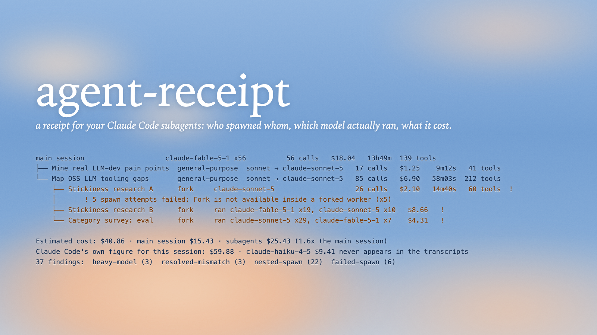

# agent-receipt

A receipt for your Claude Code subagents: who spawned whom, which model **actually** ran, what it cost, and which of your rules were broken.



## Why

Claude Code's `/cost` and status line cover the main conversation only. Subagents, forks and Workflow fan-outs run somewhere else, on a model you asked for but cannot verify ([#43869](https://github.com/anthropics/claude-code/issues/43869) and six sibling issues report "I asked for Sonnet, Opus ran"). The transcripts on disk know exactly what happened. `agent-receipt` reads them and prints the bill. Nothing leaves your machine.

On the author's machine it found 700 agents across 67 sessions, 587 of them launched by the Workflow tool and invisible to every other tool surveyed, 20 sessions where a subagent ran a heavier model than requested, and one $240 session counted twice by naive totals. Details, method and issue links: [docs/evidence.md](docs/evidence.md).

## Install

```bash
uv tool install git+https://github.com/madara88645/agent-receipt
```

Python 3.11+, no dependencies. `pipx` works too.

## Use

```bash
agent-receipt                  # latest session of the current directory
agent-receipt be176aa4         # any session, id prefix is enough
agent-receipt --since 7d       # one table for every session touched this week, all projects
agent-receipt --all            # the same for everything on disk
agent-receipt --json           # machine-readable, both modes
agent-receipt --policy my.toml # your own rules and budgets
```

Exit code is `1` when there are findings, `0` otherwise, `2` on usage errors.

A single receipt is the tree of agents with, per agent: requested → actual model, calls, tokens, dollars, wall-clock time, tool calls, failed spawn attempts, and the findings grouped by rule. The last lines say what the subagents cost relative to the main session and, when Claude Code wrote its own `cost-state` record, how the two figures compare per model.

The weekly digest folds sessions into one table: date, project, title, agents, main cost, subagent cost, findings; then totals, subagent cost by type (general-purpose, fork, workflow-subagent, your custom agents), and the most expensive sessions. A continued session is counted once: the history it inherited from the session it resumed is credited there, not twice.


## Run it on every session

```bash
agent-receipt --print-hook-config
```

Paste the output into `~/.claude/settings.json` (or merge it into your `hooks`). Every session you close then leaves `~/.claude/agent-receipt/<session>.txt` and prints one line:

```
agent-receipt: 25 agents · $40.86 · 37 findings → ~/.claude/agent-receipt/be176aa4-….txt
```

The hook never blocks or fails a session.

## Rules

| rule | fires when |
|---|---|
| `heavy-model` | a subagent ran on a model outside `cheap_models` |
| `resolved-mismatch` | the launcher reported one model, the calls ran on another |
| `model-switch` | one agent used more than one model |
| `nested-spawn` | an agent sits deeper than `max_depth` (default 1) |
| `failed-spawn` | Agent calls that errored: concurrency limit, fork inside a fork |
| `over-budget` | an agent or the session cost more than `max_agent_cost` / `max_session_cost` |
| `too-many-agents` | more agents than `max_agents` |
| `missing-transcript` | spawn recorded, no transcript file found |

Policy file, every key optional:

```toml
cheap_models = ["claude-sonnet-*", "claude-haiku-*"]
max_depth = 1
max_agents = 0            # 0 = no limit
max_agent_cost = 0.0      # USD, 0 = no limit
max_session_cost = 0.0
flag_failed_spawns = true

[prices."claude-sonnet-5*"]      # USD per million tokens, fnmatch pattern
input = 2
cache_write = 2.5
cache_read = 0.2
output = 10
```

## What it reads

`~/.claude/projects/<cwd>/<session>.jsonl` plus `<session>/subagents/agent-*.jsonl`, the `agent-*.meta.json` next to them, and `<session>/subagents/workflows/<run>/agent-*.jsonl` for Workflow runs. Children of a continued session are looked up in sibling session directories too. Forks copy their parent's history, so each child is credited to exactly one parent and each failed attempt is counted once.

Dollar figures are list-price estimates and a lower bound: Claude Code also makes housekeeping calls that never reach the transcripts (see [docs/evidence.md](docs/evidence.md)).

## Develop

```bash
uv run pytest -q                       # 76 tests on synthetic transcripts
uv run python scripts/corpus_check.py  # anonymous statistics over your own sessions
```

MIT
